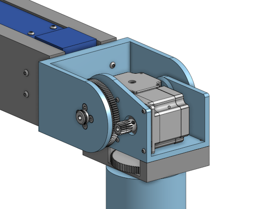
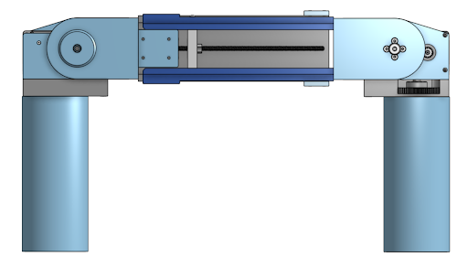
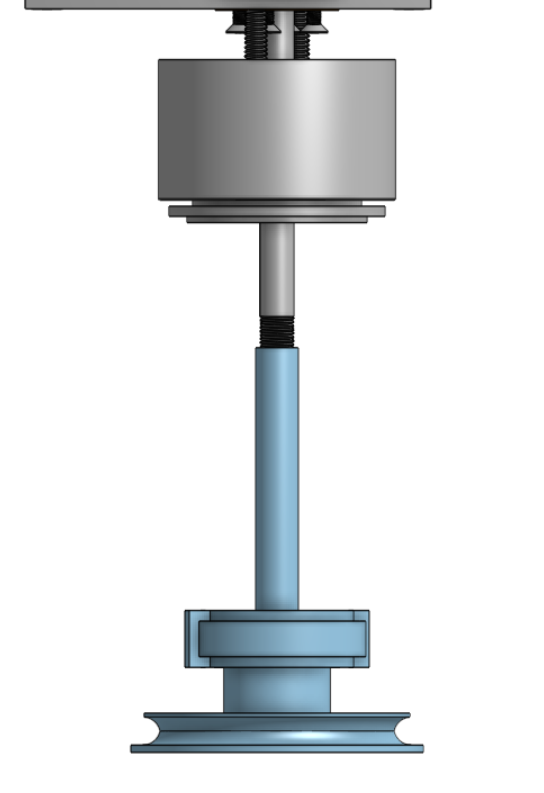
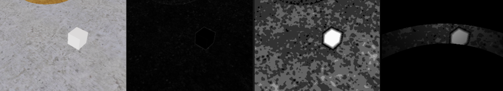
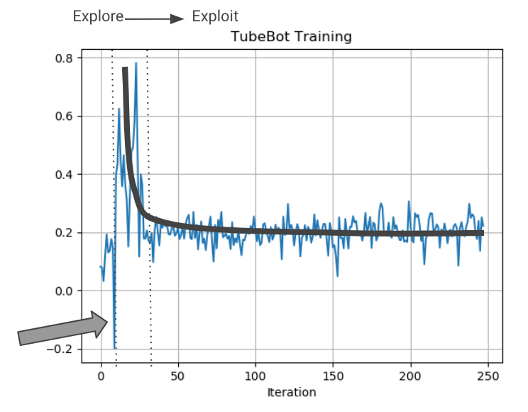
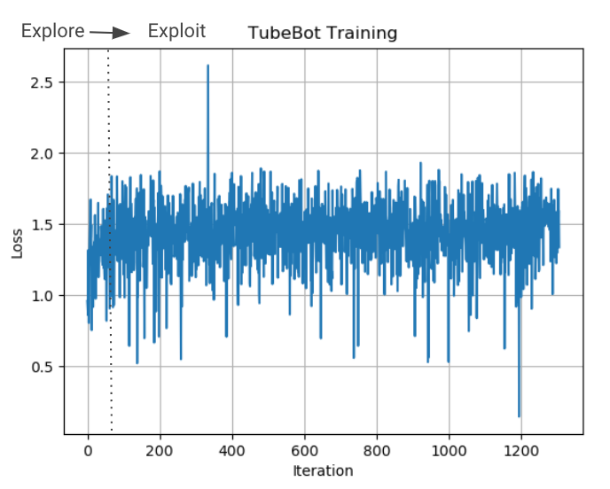

# TubeBot: A Novel Robot for Scaling Buildings and Providing Floodlight

## Overview
TubeBot is an innovative robotic solution designed to autonomously scale buildings and provide floodlighting in urban environments. This project combines advanced mechanical design with reinforcement learning to address challenges in urban lighting, particularly in hard-to-reach or temporary setups.

---

## Features
- **Autonomous Climbing:** Utilizes suction cups and stepper motors for vertical navigation.
- **Dynamic Floodlighting:** Provides adaptable lighting solutions for various urban scenarios.
- **Reinforcement Learning Integration:** Employs advanced algorithms to optimize movement and stability.
- **Rapid Deployment:** Designed for quick setup without the need for permanent infrastructure.

---

## Applications
- Emergency response zones
- Construction sites
- Outdoor events
- Security surveillance
- Hard-to-reach urban areas

---

## System Design

### Mechanical Design
The robot features a symmetrical structure with mechanisms on each ankle, allowing for flexible movement. Key components include:
- **Dual Stepper Motors:** Each foot is powered by stepper motors with a 1:6 gear ratio for increased torque.
- **Linear Actuator:** Extends the body by 6 inches, enhancing its working area.
- **Suction Cups with Solenoids:** Provides secure adhesion to flat surfaces.

  
  
  

---

## Autonomy Stack
The autonomy stack comprises three main elements:
1. **Simulation Environment:** Developed in CoppeliaSim for realistic testing and training.
2. **Affordance Algorithms:** Identifies regions that the robot can safely interact with.
3. **Reinforcement Learning:** Utilizes Actor-Critic methods to learn optimal control strategies for climbing and lighting.

---

## Results

### Experiment 1: Basic Feasibility
The initial experiment tested a simplified model without affordance or dynamic action space. The agent successfully learned theta optimization, demonstrating the feasibility of the approach.

### Experiment 2: Full System Integration
The second experiment integrated affordance and length optimization into the model. While the training was less successful due to high-dimensional complexity, it provided valuable insights for future improvements.

---

## Future Work
- Integrate **Visual Transformers (ViT)** for better generalization of complex environments.
- Transition to durable production materials such as injection-molded or machined parts.
- Address state-space challenges by increasing training times and improving model architectures.

---

## For More Information
For more detailed insights into the methodology and results, refer to the full paper:

[Download the PDF](media/Paper.pdf)

---

## Acknowledgments
Developed by:
- **Elliot Weiner**
- **Anthony Southmayd**
- **Parker Boss**
- **Christina Cavalluzzo**
